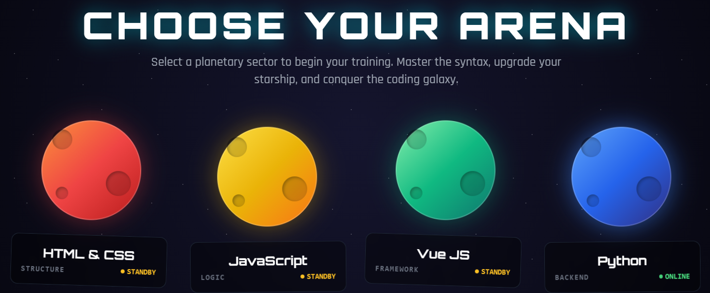

# 🚀 Robo-Code Arena

**A zero-setup, serverless, interactive Python and JavaScript learning environment for kids and beginners.**

Robo-Code Arena is a programming 20-level curriculum designed to bridge the gap between drag-and-drop block coding (like Scratch) and text-based programming. By typing real code, players control starships, bypass firewalls, and orchestrate quantum defenses in a dynamic, browser-based cyber-arena.

---

## 🎮 Play the Game Now
**[Launch Code-Arena](https://kassapoglou.github.io/main)** 
*(No installation, no accounts, and 100% free).*

---

## 🧠 The Python Curriculum Structure
The game is divided into three distinct phases, teaching real-world software architecture through gamification:

### Phase 1: Junior Cadet (Beginner)
*   **Concepts:** Variables, Arrays, Conditionals (`if/else`), Loops (`while/for`), Dictionaries, and Functions.
*   **Scenarios:** Navigating grid mazes, bypassing cryptographic firewalls, and managing thruster telemetry.

### Phase 2: System Architect (Intermediate)
*   **Concepts:** Object-Oriented Programming (OOP), Class Inheritance, Error Handling (`try/except`), List Comprehensions, and File I/O.
*   **Scenarios:** Inheriting weapon systems onto base starships, catching fatal errors in ion nebulas, and reading/writing docking clearance logs.

### Phase 3: Quantum Engineer (Advanced)
*   **Concepts:** Greedy Algorithms (Min/Max), Generators (`yield`), and Concurrency (`async/await`).
*   **Scenarios:** Filtering infinite debris streams without crashing system RAM, and deploying concurrent drones to escape a supernova.

---

## ⚙️ The Technical Architecture (Under the Hood)
Robo-Code Arena was engineered with a strict **Local-First, Zero-Overhead** philosophy. It requires no backend servers, no Docker containers, and costs $0 to host.

### The Tech Stack:
*   **Vue.js 3 (Composition API):** Handles reactive state management, tying the Python editor directly to the visual telemetry UI and the AI Tutor's dialogue box.
*   **HTML5 Canvas & RequestAnimationFrame:** Drives the 60fps rendering pipeline for complex coordinate geometry, particle exhaust systems, and collision detection.
*   **Tailwind CSS:** Powers the responsive, neon "cyberpunk" aesthetic using utility classes.
*   **Web Storage API:** Utilizes `localStorage` to persistently track user progression across all 20 lessons natively in the browser.

### 🤖 The Simulated AI Engine
To keep the application entirely client-side and free from costly API dependencies, the "BYTE" AI Tutor is powered by a custom **Deterministic Parsing Engine** built in Vanilla JavaScript. 

Instead of sending code to a cloud LLM, the engine intercepts the user's raw string input, sanitizes it, and uses complex Regular Expressions (`RegEx`) to evaluate abstract syntax. It catches infinite loops, validates indentation, and unrolls execution queues to provide dynamic, contextual feedback as if an AI was reading the code.

